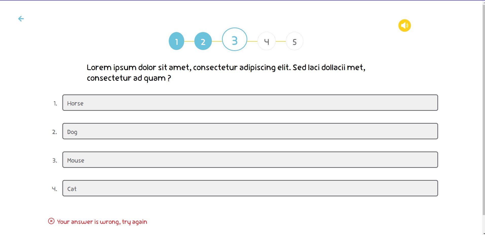

# Front-End Kutubee Task

## Author: Ammar Abul-Feilat

## overview

Making a MemoryGame and a QuizGame using `React` with a Backend `Node.js` and `Express` using `MongoDB` and `Mongoose`. where you can add more questions and games.<https://github.com/Ammaro173/Kutubee-task-BE> check the code on Github.

quizGame is a quiz game that asks the user questions and gives them the option to answer the question or not.
the game is over when the user answers all the questions.

the memoryGame is a memory game that asks the user to memorize the cards and then flip them back over.
the game is over when the user solves all the cards.

## Architecture

- ES6 ( ECMAScript 6)
- "react": "^17.0.2",
- "react-dom": "^17.0.2",
- "react-router-dom": "^6.3.0",

## Run the Project

- clone the repo && change directory to the repo

- run `yarn install` or `npm install`

- open the browser and navigate to `http://localhost:7777` to change the port you can specify `yarn dev --port <port number>` or go to package.json change the port

- to run file `npm run start`

- also check it deployed on netlify by navigating to <https://fabulous-pegasus-ba1293.netlify.app/>

### Landing page

### MemoryGame

### QuizGame

